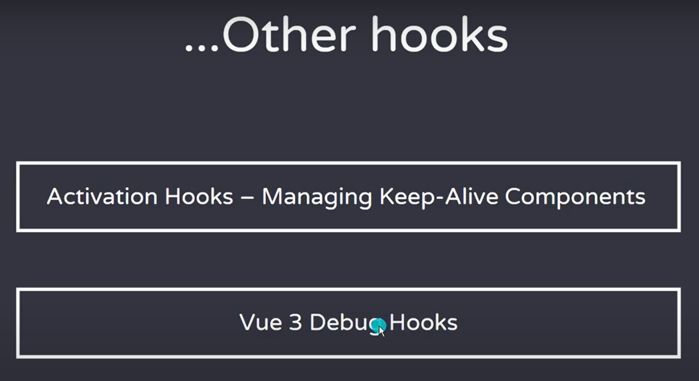
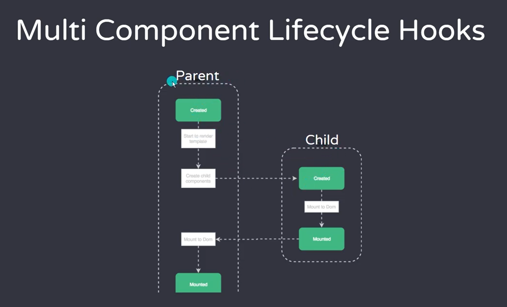

## Những cập nhật mới ở Vue3

- **Activation Hooks** : quản lý `cache` của `component`
  + `Keep-Alive component` : sau  khi chuyển sang comp khác, comp cũ vẫn còn giữ dữ liệu. Ko bị mất đi như comp bình thường.

## Multi component Lifecycle hooks

> https://learnvue.co/articles/vue-lifecycle-hooks-guide

#### Vấn đề khi fetching data trong child component

- Gọi API ở `Mounted` của `Child` -> `emit` lên `Parent` ==> **Sai**. Vì:
  + Lúc này `Parent` chưa chạy tới `Mounted` để lắng để sự kiện từ con `emit` lên (undefined)

